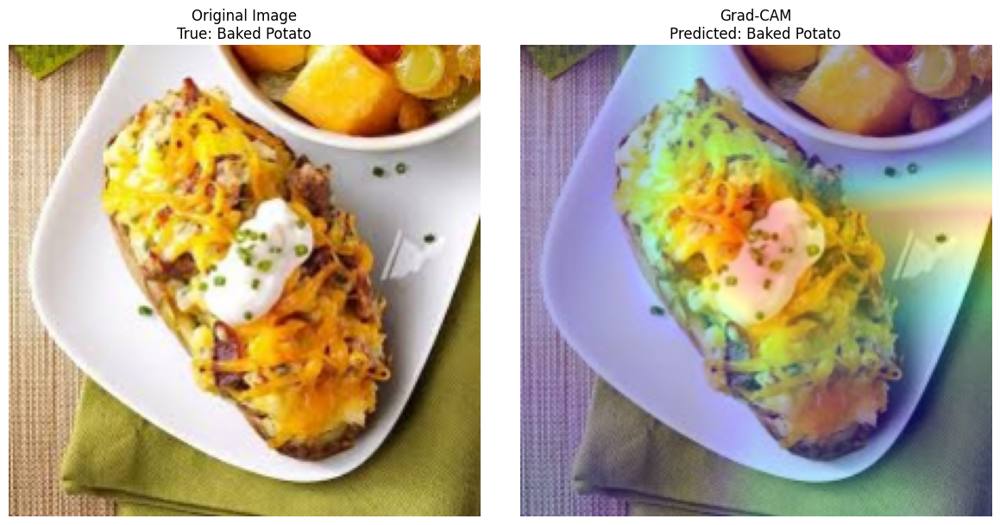

# PyTorch-CNN-for-food-image-classification-system

## Table of Contents

- [Project Overview](#project-overview)
- [Dataset](#dataset)
- [Methods with PyTorch](#methods-with-pytorch)
- [Visualization and Preprocessing](#visualization-and-preprocessing)
- [Baseline CNN Models](#custom-cnn-models)
  - [Model Architecture](#model-architecture)
  - [Results of Baseline CNNs](#results-of-custom-cnns)
- [Transfer Learning](#transfer-learning)
  - [Model Architecture](#transfer-learning-model-architecture)
  - [GRAD-CAM implementation](#grad-cam-implementation)
  - [Results of Transfer Learning](#results-of-transfer-learning)
- [Key Insights](#key-insights)
- [Conclusions](#conclusions)
- [How to Run](#how-to-run)
- [EXTRA: GUI for a user-friendly system](#EXTRA-GUI-for-a-user-friendly-system)

## 🌟 Project Overview

This repository is the sixth project of the master's degree in AI Engineering with [Profession AI](https://profession.ai), all the credits for the requests and idea go to this team. 

GourmetAI Inc., a renowned food technology company, faces increasing challenges in improving the accuracy and efficiency of food image classification systems. GourmetAI Inc. requested the development of an advanced food image classification model using deep learning techniques.

Project Benefits:
- Improved User Experience
- Optimized Business Processes
- Technology Innovation

Project Objectives:
- Augmentation Strategies: implement different augmentation techniques to enrich the dataset, improving data variability and quality.
- Network Architectures and Transfer Learning: select and implement one or more neural network architectures suitable for the problem, using transfer learning to exploit pre-trained models.
- Fine Tuning and Hyperparameters Choice: create a custom classifier, choose the hyperparameters and optimize the model through training and validation processes.
- Validation and Regularization: retraining with validation and regularization techniques to improve the model performance.

## 🍽️ Dataset

The project will be based on the Food Classification dataset, enriched with augmentation techniques to improve the diversity and quality of the available data. This is the [link](https://proai-datasets.s3.eu-west-3.amazonaws.com/dataset_food_classification.zip) to download the dataset.

This dataset is composed by:
- 14 classes with
  - 640 images for training
  - 160 images for validation
  - 200 images for test

## 🛠️ Methods with PyTorch

This project leverages PyTorch to implement a robust and flexible system for training and evaluating CNN models. I've designed several custom classes to streamline the experimental process, you can find them [here](src/models.py)

### Experiment Class

The `Experiment` class serves as the backbone of the training pipeline. It manages:

- Logging of training progress
- Saving and loading of model weights
- Visualization of training history
- Exporting of results

Key features:
- Automatic creation of directory structure for each experiment
- CSV logging of training and validation metrics
- Plotting of training history
- JSON export of final results

### Callback System

I've implemented a callback system inspired by Keras, allowing for flexible control of the training process:

1. **EarlyStopping**: Prevents overfitting by stopping training when a monitored metric has stopped improving.
2. **ModelCheckpoint**: Saves the best model based on a specified metric.
3. **ReduceLROnPlateau**: Reduces learning rate when a metric has stopped improving.

### Model Architecture

I've implemented two main model architectures:

1. **BaselineCNN**: A simple CNN architecture for baseline comparisons.
2. **EfficientNetTransfer**: A transfer learning model based on EfficientNet, allowing for easy experimentation with different EfficientNet versions.

### Training and Evaluation Functions

The `train_model` function encapsulates the entire training loop, including:

- Epoch-wise training and validation
- Logging of metrics
- Execution of callbacks
- Resuming training from checkpoints

The `validate` and `get_predictions` functions provide easy-to-use interfaces for model evaluation and inference.

### Grad-CAM Visualization

I've implemented the Grad-CAM algorithm in the `apply_gradcam` function, allowing for visual explanation of model decisions.

This modular and extensible design allows for easy experimentation with different models, training strategies, and visualization techniques.

## 🖼️ Visualization and Preprocessing

I conducted a comprehensive Exploratory Data Analysis to understand this dataset better. The full EDA can be found in the [project notebook](pytorch_CNN.ipynb), but here are some key insights:

- Class Distribution: The dataset is well-balanced across all 14 classes, with:
  - 640 images per class in the training set
  - 200 images per class in the test set
  - 160 images per class in the validation set

- Image Dimensions: All images are consistently sized at 512x512 pixels.

- Color Distribution: Analysis of a sample of images revealed a tendency towards red tones, with less representation in the blue spectrum.

For a more detailed visual exploration of the dataset, including class distribution plots, image dimension analysis, and color histograms, please refer to the EDA section in the project notebook. Functions code is [here](src/viz_fx.py)

### Preprocessing and Data Augmentation

Preprocessing pipeline was implemented using the `Albumentations` library, chosen for its efficiency and wide range of image augmentation techniques. The pipeline includes:

1. Resizing: All images are resized to 224x224 pixels to standardize input for these models.
2. Normalization: Images are normalized using mean and standard deviation values of (0.5, 0.5, 0.5) for each channel.

For data augmentation, I implemented a conservative approach to avoid over-distorting the food images:

1. A.RandomRotate90()
2. A.Flip()
3. A.Transpose()

You can find [here](src/preprocessing.py) the class Transforms and methods I've used for this project step.

## 🔬 Baseline CNN Models

### Model Architecture

I implemented a baseline Convolutional Neural Network (CNN) model to establish a performance benchmark. The model architecture is defined in the `BaselineCNN` class within the `models.py` file. This class includes the `__init__` method for setting up the network layers and the `forward` method for defining the forward pass.

For a detailed look at the model architecture, please refer to the `models.py` file, [here](src/models.py).

### Results of Baseline CNNs

I trained and evaluated the baseline model using various metrics:

- Loss
- Accuracy
- Precision
- Recall
- F1 Score

Additionally, I generated a confusion matrix using the test data to visualize the model's performance across different classes.

As expected for a baseline model, the performance was modest but provided a good starting point for comparison. Both versions of the baseline model (with and without data augmentation) achieved an accuracy slightly above 60%. Considering this is a 14-class classification problem, this baseline performance is respectable. Also, results from test set are similir to what I got from trainign and validation.

It's worth noting that I experimented with additional augmentation techniques like `A.Sharpen` and `RandomBrightnessContrast`, but these did not significantly impact the results.

For a comprehensive analysis of the baseline model's performance, including detailed metrics and visualizations, please refer to the [project notebook](pytorch_CNN.ipynb), where you can train and evaluate these models. Plots from Baseline CNN with augmentation are present in history [folder](experiments/BaselineCNN_with_aug/history/) and [here](images/).

## 🚀 Transfer Learning

### Model Architecture

For the main model, I implemented transfer learning using EfficientNet. The `EfficientNetTransfer` class in `models.py` encapsulates this architecture. This approach leverages pre-trained weights on large datasets, allowing for efficient learning on this specific food classification task.

For a detailed look at the model architecture and implementation, please refer to the `models.py` file, [here](src/models.py).

### GRAD-CAM Implementation

I implemented Gradient-weighted Class Activation Mapping (Grad-CAM) to visualize which parts of an input image are important for the model's classification decision. Grad-CAM works by:

1. Extracting the gradient information flowing into the last convolutional layer of the CNN.
2. Using this gradient information to highlight the important regions in the image for predicting the concept.

This technique provides insights into the model's decision-making process. An example Grad-CAM visualization is shown below:

### Results of Transfer Learning

EfficientNet-based transfer learning model achieved impressive results across all datasets. Here's a summary of the performance:

| Dataset       | Loss (±SD)  | Accuracy (±SD) | Precision (±SD) | Recall (±SD) | F1 Score (±SD) |
|---------------|-------------|----------------|-----------------|--------------|----------------|
| Training Set  | 0.65 ± 0.19 | 0.79 ± 0.04*   | 0.79 ± 0.04     | 0.79 ± 0.04  | 0.79 ± 0.04    |
| Validation Set| 0.65 ± 0.09 | 0.79 ± 0.01    | 0.80 ± 0.01     | 0.79 ± 0.01  | 0.79 ± 0.01    |
| Test Set      | 0.64      | 0.80         | 0.80          | 0.80       | 0.80         |

*Note: Training and Validation results are up to epoch 60 (early stopping). Peak accuracy during training exceeded 81%.

These results demonstrate excellent performance, with approximately 80% accuracy across a 14-class classification problem. This significant improvement over the baseline model showcases the power of transfer learning and the effectiveness of EfficientNet for this task.

The robust code structure, including custom classes for experiment management and callbacks, facilitated efficient model training and evaluation. For a comprehensive analysis of the model's performance, including detailed metrics, learning curves, and additional visualizations, please refer to the project notebook.

## Key Insights

## Conclusions

## How to Run

## EXTRA: GUI for a user-friendly system

